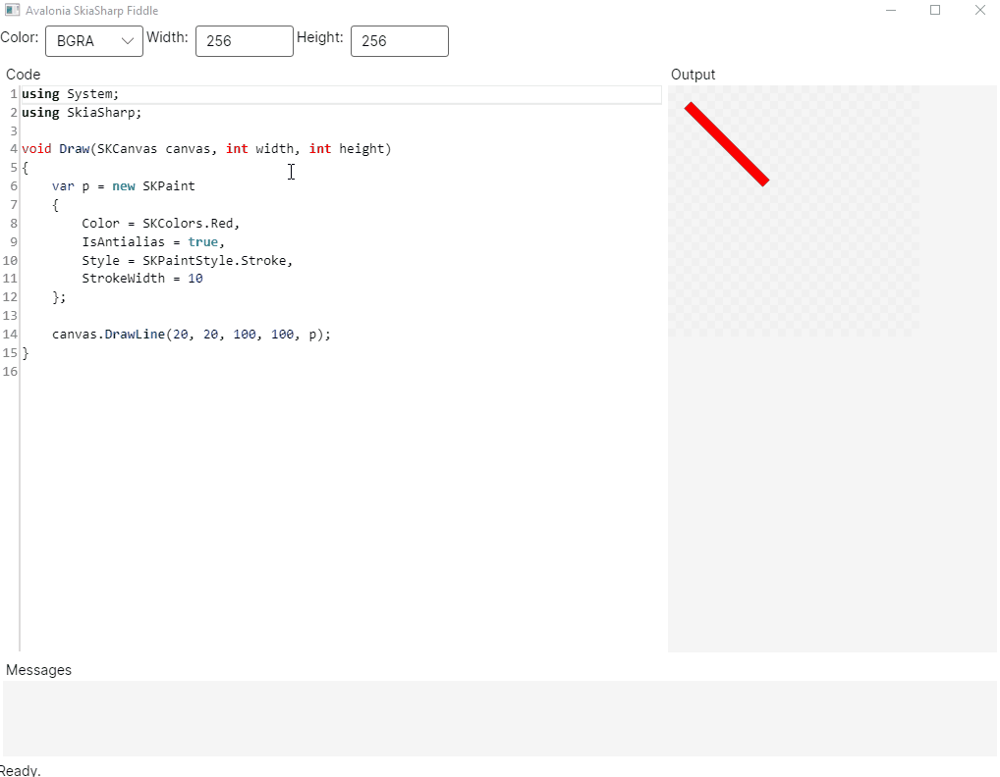

# Avalonia SkiaSharp Fiddle

**Avalonia SkiaSharp Fiddle** is a SkiaSharp playground - just like https://fiddle.skia.org, but created with Avalonia and running on macOS, Linux, Windows and WebAssembly.

Based on the fantastic [tool](https://github.com/mattleibow/SkiaSharpFiddle) created by [Matthew Leibowitz](https://github.com/mattleibow).

## Copyright and license

Code released under the [MIT license](https://opensource.org/licenses/MIT).